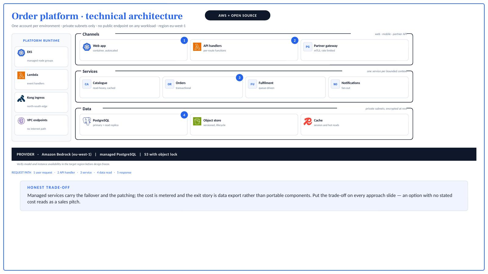
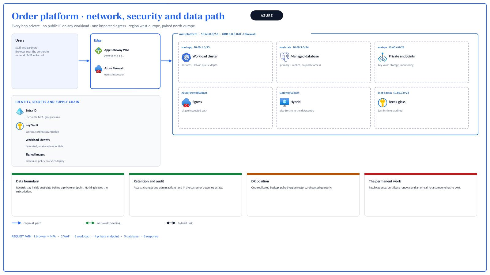
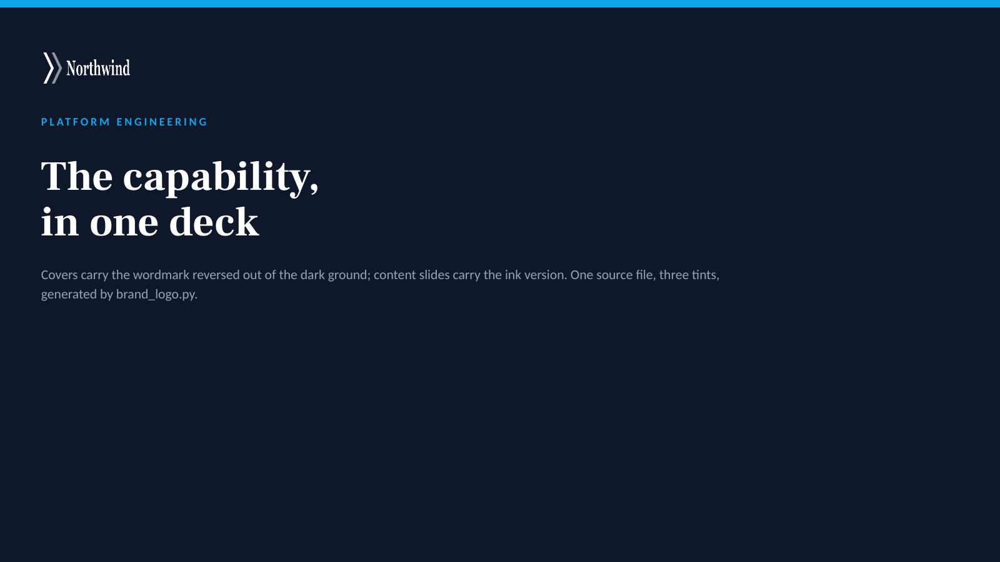
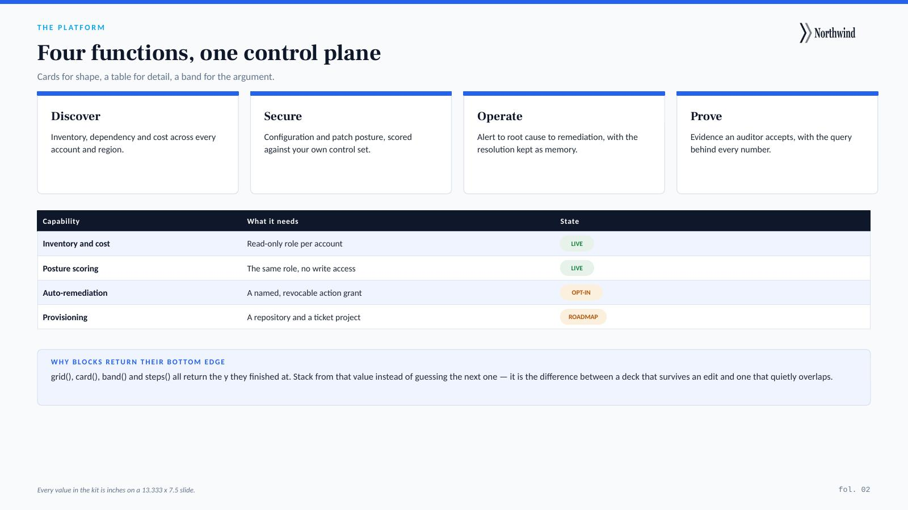

# cloud-arch-deck

Generate **customer-ready architecture diagrams and capability decks** as editable
PowerPoint — for Azure, AWS and open-source stacks — from code.

Native shapes, real vendor logos, and a layout language that survives review by a
customer's platform and security team. Works standalone, or as a
[Claude Code](https://claude.com/claude-code) skill so you can ask for a diagram in
plain language and get a `.pptx` back.



## Why this exists

Architecture slides usually fail in one of three ways. They are a screenshot pasted onto
a slide, so nobody can edit them. They use hand-drawn boxes instead of real service
icons, so nobody believes them. Or they show components without a network boundary, a
request path or a trade-off, so the customer's security team sends them back.

This fixes all three, and it does it from code — so the diagram is diffable, repeatable,
and regenerates when the design changes.

## What you get

- **Three icon sets behind one command** — ~666 Azure, ~809 AWS, ~3,400 open source
- **Editable PowerPoint**, native shapes, no rasterised diagrams
- **A layout language** for architecture slides: containers, network boundaries, subnets
  with real CIDRs, numbered request paths, connectivity legends, scope colour-coding
- **Deck blocks** — cover, content slide, grid, cards, comparison panels, stat bands
- **A render-and-inspect loop**, because generating a deck is not the same as looking at one
- **A known-defects table** in `references/conventions.md` — every layout bug found the
  hard way, with its cause and fix

## Install

```bash
git clone https://github.com/<you>/cloud-arch-deck.git
cd cloud-arch-deck

brew install librsvg poppler              # rsvg-convert, pdftoppm
brew install --cask libreoffice           # headless render, for inspection
npm install pptxgenjs                     # in whatever folder you generate from
```

Linux: `apt install librsvg2-bin poppler-utils libreoffice`.

### As a Claude Code skill

```bash
cp -R cloud-arch-deck ~/.claude/skills/
```

`SKILL.md` carries the trigger description, so "draw the target architecture for X on
AWS" or "turn this into a capability deck" picks it up without naming the skill.

## Sixty-second start

```bash
python scripts/icons.py --list bedrock              # find the exact icon names
python scripts/icons.py aws AmazonBedrock AWSLambda
python scripts/icons.py oss kubernetes postgresql
cd examples && npm install pptxgenjs && node 01_architecture.js
../scripts/render.sh out/01-architecture.pptx       # then LOOK at it
```

## Icons

```bash
python scripts/icons.py --list vpc            # search all three catalogues at once
python scripts/icons.py azure Firewalls Key_Vaults Virtual_Networks --grey
python scripts/icons.py aws AmazonElasticKubernetesService AmazonVPCEndpoints
python scripts/icons.py oss kubernetes postgresql grafana kong minio
```

| Set | Count | Notes |
|---|---|---|
| Azure | ~666 | Catalogue built at run time and cached. Some services have no icon — Document Intelligence, Durable Functions, Bicep. |
| AWS | ~809 | Official Architecture Icons, including the `architecture-group` boundary marks for VPC, account and region. |
| Open source | ~3,400 | simple-icons, rendered in each project's own brand colour. |

**Always `--list` first.** AWS uses full service names — `AmazonSimpleStorageService`,
not `AmazonS3`. A near-miss prints the closest matches instead of failing silently.

**No artwork is vendored.** Icons are fetched on first use and cached in `.icon-cache/`,
so this repository carries no vendor's terms. Read [NOTICE.md](NOTICE.md) before a
diagram leaves your building.

## The network slide

The one a security reviewer actually reads: boundaries, subnets with real names and
CIDRs, identity and secrets, the data boundary, and the DR position.



## Decks, not just diagrams

Cover, content slides, comparison panels, close.




## Make it yours

Two things, and nothing else needs touching:

```bash
# 1. your wordmark, tinted for light and dark grounds
python scripts/brand_logo.py assets/your-wordmark.png assets/logo \
    --tint white:ffffff --tint ink:0F172A --tint brand:2563EB

# 2. your colours — edit DEFAULT_THEME in scripts/deck_kit.js, or pass a theme:
#    kit.bind(p, { theme: { brand: "831B83", ink: "150027", spark: "E330D0" } })
```

Most brand kits ship a white-on-transparent wordmark, which renders as *nothing* on a
white slide — the most common "the logo is missing" bug. `brand_logo.py` tints the
artwork through its own alpha channel, so one source file gives every variant.

## Layout rules worth knowing

The full set is in [`references/conventions.md`](references/conventions.md). The ones
that decide whether a diagram is believed:

1. **Organise by the customer's own boundary** — resource group, account, VPC, namespace.
   A reviewer should be able to map each container to something their IaC creates.
2. **Draw networking, never annotate it.** CIDRs in the label, subnets with real names.
3. **Draw every link, with a label**, and finish with a connectivity legend.
4. **Number the request path** so the diagram can be walked 1→n in a meeting.
5. **Never use grey for "existing".** Grey plus desaturated icons reads as *empty*. Use a
   second solid colour with full-colour icons; keep grey for genuinely out-of-scope.
6. **State the trade-off.** An option with no stated cost reads as a sales pitch.
7. **Blocks return their bottom edge.** `grid()`, `card()`, `band()` and `steps()` all
   return the y they finished at. Stack from that, never from a guessed number.

## Repository layout

| Path | What |
|---|---|
| `SKILL.md` | Trigger description and instructions, for use as a Claude Code skill |
| `scripts/icons.py` | One entry point for Azure, AWS and open-source icons |
| `scripts/deck_kit.js` | Slide shells, layout blocks and architecture primitives |
| `scripts/brand_logo.py` | Tint a transparent wordmark for light and dark grounds |
| `scripts/render.sh` | Render a `.pptx` to page images for inspection |
| `references/conventions.md` | Palette, geometry, network defaults, known defects, checklist |
| `examples/` | Architecture slide, network slide, three-slide deck |
| `samples/` | The rendered output of those examples — the images above |

## Contributing

Issues and pull requests welcome. Useful contributions: more worked examples, GCP icon
support, a Keynote or Google Slides writer, and additions to the known-defects table —
if a layout bug cost you an afternoon, it belongs there.

## Licence

[MIT](LICENSE) for the code and documentation. Icon artwork is **not** covered by it —
see [NOTICE.md](NOTICE.md).
